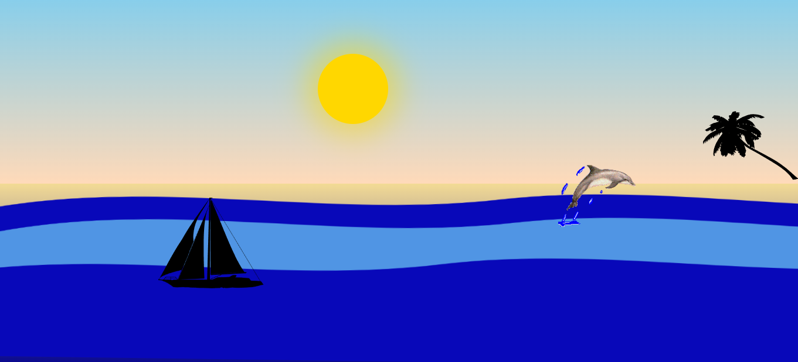
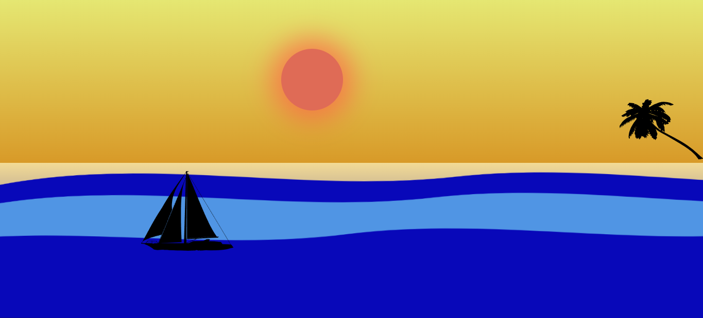

# Prainha

Este projeto é uma atividade desenvolvida para a disciplina de **Desenvolvimento Web**. A proposta é criar uma página web interativa utilizando HTML e CSS, explorando animações, interações e estilizações avançadas.

---

## 🖼️ Demonstração

A página representa um cenário tropical com:

- **Céu** com gradiente dinâmico que muda ao interagir com o sol.
- **Sol** animado que muda de cor e posição ao ser clicado.
- **Água** com ondas animadas em movimento.
- **Barco** flutuante.
- **Árvore** decorativa posicionada na areia.
- **Areia** com transições de cores.

---

## 🚀 Tecnologias Utilizadas

- **HTML5**: Estrutura do layout da página.
- **CSS3**: Estilização, animações e interações dinâmicas.

---

## 🎨 Recursos e Funcionalidades

### 🌞 Sol

- Aparece no céu com **efeitos de hover**.
- Muda de cor e faz o céu reagir com um gradiente ao passar o mouse.

### 🌊 Água e Ondas

- Ondas animadas usando a propriedade `clip-path` e keyframes CSS.
- Movimento fluido e contínuo das ondas.

### 🛶 Barco

- Animação de flutuação para simular movimento na água.

### 🌴 Árvore

- Elemento decorativo na areia, com leve inclinação.

---

**_Entre em contato comigo_**

- **E-mail**: [izabelle.alvesbl@gmail.com](mailto:izabelle.alvesbl@gmail.com)
- **LinkedIn**: [Izabelle Alves](https://www.linkedin.com/in/izabellealvess/)
